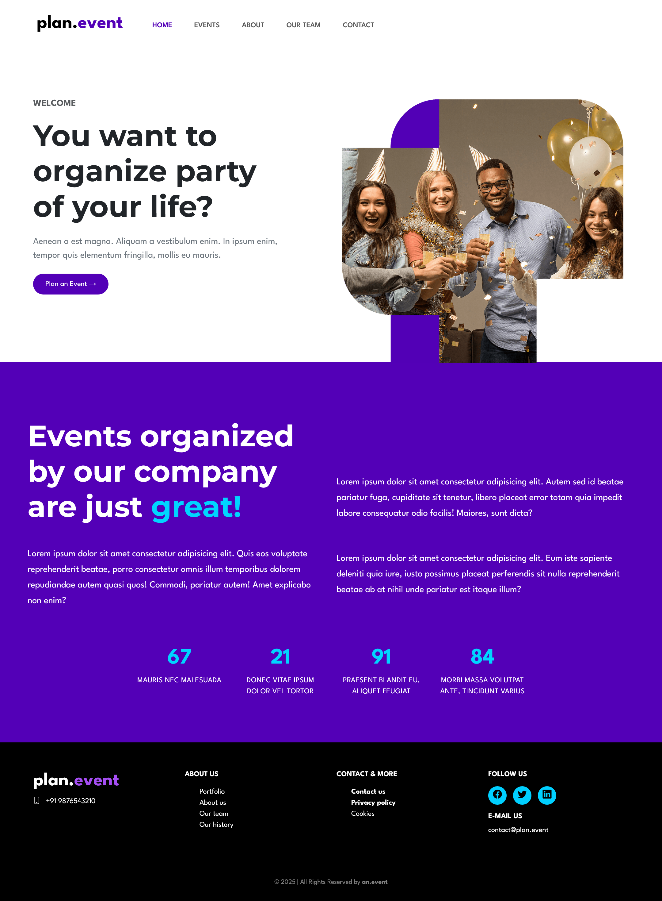

# 🎉 plan.event

**plan.event** is a modern single-page website for event planning services, inspired by the elegant design of [BeTheme Event 6](https://themes.muffingroup.com/be/event6/). It's perfect for showcasing your services, introducing your team, and providing easy contact options.

🚀 **Live Preview:** [https://sayeedmunees.github.io/plan-event/](https://sayeedmunees.github.io/plan-event/)

---

## 📸 Preview



---

## 🧰 Built With

- **HTML5**
- **CSS3**
- **[Bootstrap 5.3.7](https://getbootstrap.com/)** – layout and components
- **[Bootstrap Icons](https://icons.getbootstrap.com/)** – iconography
- **[Google Fonts](https://fonts.google.com/)** – Montserrat & League Spartan

---

## ✨ Features

- 🧭 **Sticky Navigation** – Always visible for easy navigation
- 🎯 **Hero Section** – Bold tagline and call-to-action button.
- 🧾 **About Section** – Brief about the company with styled stats.
- 📞 **Footer Section** – Contact info, social icons, and links.

---

## 🛠️ How to Use

1. **Clone the repository:**
   ```bash
   git clone https://github.com/sayeedmunees/plan-event.git
   cd plan-event
